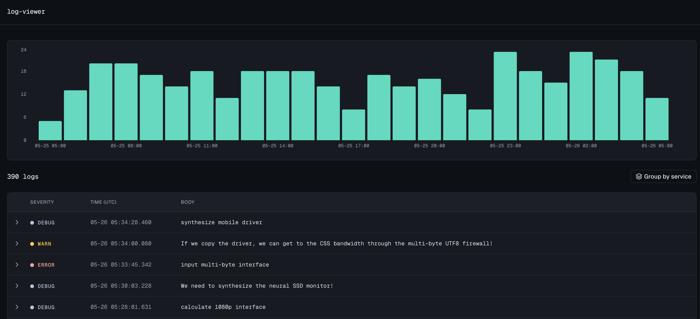

# log-viewer

A log viewer built with Next.js 16, React 19, and Tailwind v4.



## Run locally

```bash
pnpm install
pnpm dev
```

Then open http://localhost:3000. Additionally, you can override `LOGS_API_URL` env variable (see `.env.example`) to point at another endpoint to fetch log records.

## Testing

Playwright is used for integration-like tests with mocked network (`next/experimental/testmode/playwright/msw`) running against a dev server.

Vitest is used for unit (mostly functions) tests covering more complex units.

```bash
pnpm test
pnpm test:pw
pnpm typecheck
pnpm lint
pnpm format:check
pnpm build
pnpm check                 # format:check + lint + typecheck + test in one shot
```

## Stack

| Layer        | Choice                                                           |
| ------------ | ---------------------------------------------------------------- |
| Framework    | Next.js 16 App Router (RSC, SSR with `<Suspense>` for streaming) |
| Runtime      | React 19 + TypeScript. React Compiler enabled                    |
| Styling      | Tailwind v4 with dark-only theme via `class="dark"` on `<html>`  |
| Components   | shadcn/ui (Radix base) — code-generated                          |
| API boundary | Zod schema                                                       |
| Charts       | Recharts                                                         |
| Tests        | Vitest for complex units. Playwright for integration testing     |

## Features implemented

- **Table view** with expandable rows. Click any row (or the chevron) to reveal body, log metadata, resource attributes, scope attributes, and record attributes.
- **Group-by-resource toggle.** Persisted to `?grouped=true` in the URL
- **Histogram** of log count over time, 1-hour buckets.
- **"Copy as prompt"** in each expanded row. Serializes the log into a Markdown investigation prompt (with severity, service, scope, attributes, body) that you can paste straight into an LLM to triage.

## Potential feature additions/improvements

Here's what I would add/improve in terms of features, given more time:

- Histogram improvements
  - Stacking bars by severity or service
  - Dynamic interval (depending on time range) and dynamic amount of buckets (last 7d -> more buckets, last 10m -> less buckets)
- Expansion of log fields. Make the layout grid-like to better use horizontal space. Or, move log details to a sidebar instead of expanding to the list.
- Better UX for listing logs by service, such as dropdown with services
- Time range selection (e.g. last 1h, 1d, 1w)
- Search functionality
- Filtering functionality, especially by fields like Severity.
- Pagination / Virtualization of logs
- Save the collapsed/expanded logs and services to URL params
- Manual and auto-refresh of logs
- Time zone handling (e.g. ability to choose UTC vs local vs arbitrary timezone)
- Light theme and preference-aware theme
- i18n. Currently there's single locale.

## Data fetching and rendering

The page is rendered server-side (request time) with an initial header + skeleton. The actual page content is server-side rendered and streamed-in after `/api/v2/logs` API request resolves.

Performance could be further improved by using Next.js [cache components](https://nextjs.org/docs/app/api-reference/config/next-config-js/cacheComponents) to statically build the header. I chose not to do so due to time limitation, as it's a relatively new Next.js feature that I haven't yet tried in practice.

```
chunk #1   Header + Skeleton    ──┐   SSR
                                  ├── in parallel
GET /api/v2/logs                ──┘   server-side
              │
              ▼
chunk #2   Page content               SSR + hydrate
```

Note: I've typed OTLP types in a stricter way than they're defined in [OTLP](https://github.com/open-telemetry/opentelemetry-proto/blob/main/opentelemetry/proto/logs/v1/logs.proto).
This allows for simpler code branching while Zod validates backend response. Could be revisited to support looser OTLP format.

## Folder structure

```
src/
  app/                   Next.js routing only — thin layer, minimal business logic
    page.tsx             ...
  features/
    logs/                Everything specific to the logs feature
      components/        Client/server React components
      api/               Wire-format and HTTP boundary
      lib/               Pure helpers that consume already-normalized data
  shared/                Cross-cutting code reusable by any feature
    components/
      ui/                shadcn primitives
    lib/                 env · format · logger · styling
```

### Rationale

The intention was a structure that scales beyond a single page without being over-engineered. It’s certainly not a silver bullet, but more of a direction that I favor when it comes to folder structure. It could be iterated further. For example, by introducing some colocation inside app/ or adding more distinction between public/private exports of a module.

**Why not colocate feature code inside `app/`?**

A reasonable alternative, but I went with the split mostly to decouple routing from modules:

- Some features don't depend on routing and may be used by different routes. Mixing them into `app/` makes the boundary fuzzy.
- Next.js routing has shifted before (pages → app router) and may shift again. Keeping features outside `app/` makes future migrations cheaper.
- Route groups could solve some of this, but at the cost of more folder complexity.
